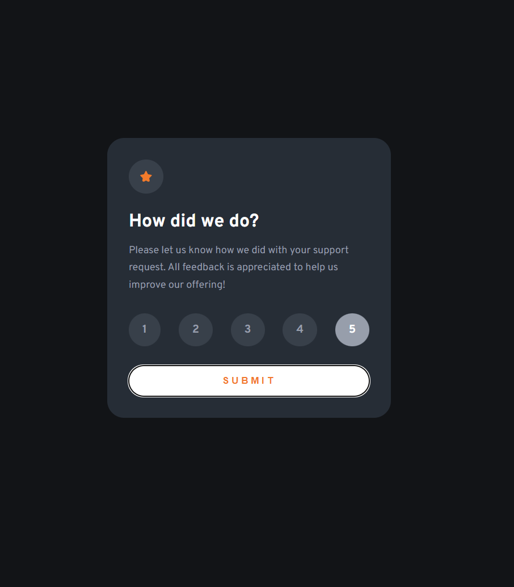

# Frontend Mentor - Interactive rating component solution

This is a solution to the [Interactive rating component challenge on Frontend Mentor](https://www.frontendmentor.io/challenges/interactive-rating-component-koxpeBUmI). Frontend Mentor challenges help you improve your coding skills by building realistic projects. 

## Table of contents

 - [The challenge](#the-challenge)
 - [Screenshots](#screenshots)
 - [Links](#links)
- [My process](#my-process)
  - [Built with](#built-with)
  - [What I learned](#what-i-learned)
- [Author](#author)
- [Acknowledgment](#Acknowledgment)

### The challenge

Users should be able to:

- View the optimal layout for the app depending on their device's screen size
- See hover states for all interactive elements on the page
- Select and submit a number rating
- See the "Thank you" card state after submitting a rating

### Screenshots

### Links
[Website](https://miikathecoder.github.io/interactive-rating-compoment/)

### Built with

- HTML
- CSS
- Javascript

### What I learned

Learned a practical example of how to use JS (Javascript).

## Author

- Frontend Mentor - [@miikaTheCoder](https://www.frontendmentor.io/profile/miikaTheCoder)

## Acknowledgment
I look at this [repo](https://github.com/Alekususenpai/interactive-rating-component), for some inspiration 
